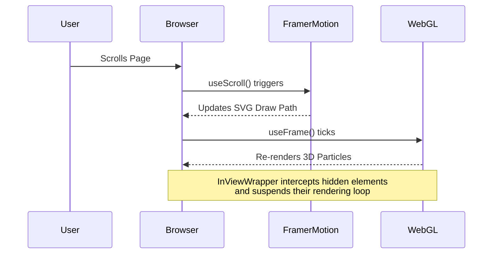
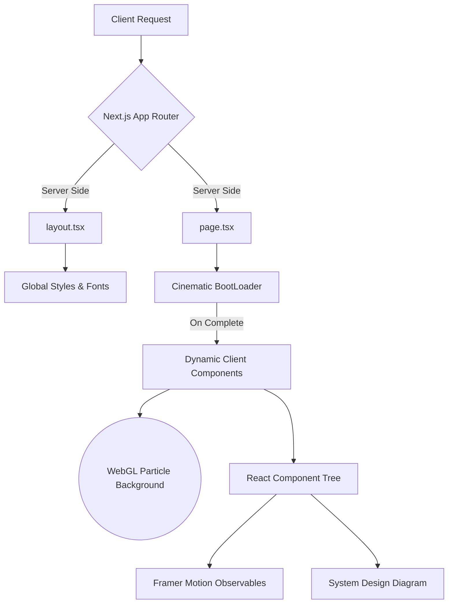

<div align="center">

# 🌌 PRANESH S // PORTFOLIO

<p align="center">
  
  
  
  
  
  
  
</p>

### ✦ Full Stack Software Developer ✦ System Architect ✦ Cybersecurity Engineer ✦

> *Building the future of secure, intelligent, and scalable digital solutions.*

</div>

---

## 🚀 SYSTEM OVERVIEW

Welcome to the **Digital Universe**, a high-performance, interactive 3D developer portfolio. Engineered with a dark, Anime-Tech and cyberpunk-inspired aesthetic, this repository serves as a technical playground demonstrating advanced frontend architecture, CI/CD automation, seamless third-party data integrations, and enterprise system design capabilities.

Unlike traditional static portfolios, this project acts as a **living, breathing digital interface**.

---

## 🎨 DESIGN PHILOSOPHY: ANIME-TECH FUSION

This portfolio pioneers a unique **Anime-Tech Fusion** design language:
- **Cyberpunk 2077 UIs:** Scanlines, holographic borders, neon glows (cyan/primary and red/secondary), and glassmorphism.
- **Solo Leveling Aesthetics:** Dramatic pop-ups, system awakening prompts, and radial glitch effects.
- **Iron Man HUDs:** Concentric circles, rotating data rings, and live telemetry tracking.
- **Apple-Level Polish:** Buttery smooth animations, physics-based scrolling, and high-performance React component trees.

---

## 🌟 ADVANCED ANIMATION ENGINE & PHYSICS

This application utilizes a complex, multi-layered animation system to achieve a liquid-smooth, interactive user experience:

- **Framer Motion Layout Projections**: Seamlessly animates components between different DOM states, providing fluid transitions for modals, popups, and the AI Terminal.
- **Scroll-Linked SVG Tracing**: Uses Framer Motion's `useScroll` and `useTransform` hooks to trace dynamic SVG paths as the user scrolls, visualizing data flows in the `Tech Ecosystem` and `System Design` sections.
- **Physics-Based Interactivity**: Features a custom-built Magnetic Cursor that uses spring physics (mass, damping, stiffness) to snap to interactive elements, completely replacing the default browser pointer.
- **WebGL Hardware Acceleration**: Offloads heavy particle calculations and 3D celestial rendering to the GPU via `react-three-fiber`, ensuring 60 FPS even with thousands of moving nodes.
- **Performance-Optimized Rendering**: Employs Intersection Observers (`InViewWrapper`) to automatically pause or unmount heavy animations when they leave the viewport, saving CPU/GPU cycles.



---

## 🏛️ ENTERPRISE ARCHITECTURE & COMPONENT TOPOLOGY

### 🎬 The Boot Sequence & Cinematic Scrolling
- **Cinematic BootLoader:** Simulates a system startup featuring hex decryption matrices and a loading sequence before seamlessly transitioning into the global UI.
- **7-Layer Matrix Aurora Background:** A deeply layered, globally fixed background featuring rotating starfields, glowing auroras, and matrix grids that provides a stunning parallax effect across every section of the site.

### 🌌 3D Environments & WebGL rendering
- **Interactive Particle Universe:** An immersive background utilizing `react-three-fiber` mapped to user mouse coordinates.
- **Skills Galaxy:** A mathematically calculated 3D orbital system categorizing technical expertise into interactive celestial bodies.
- **Tech Sphere:** A constantly rotating, dynamic tag cloud of core technologies rendered natively on the canvas.

### 🌐 Next.js 15 App Router & Turbopack
- **Server-Side Rendering (SSR)**: Optimizes critical paths for SEO and rapid Initial Page Loads.
- **Component Segregation**: Strict boundary enforcement between Server Components and Client Components (`"use client"`) to minimize JavaScript payload sizes.
- **Dynamic Imports**: Heavy WebGL and 3D components are dynamically imported using `next/dynamic` with `ssr: false` to prevent hydration mismatches and block rendering.



### 🏛️ System Architect Ecosystem
- **Tech Ecosystem Universe**: Visualizes the full stack (Frontend, Backend, Database, Cloud, Security, AI) with animated SVG data flows running between the layers.
- **Enterprise System Design Map**: An interactive network architecture map showing Client -> API Gateway -> Microservices -> DB data flows with moving, glowing packets.
- **Dev Command Center**: A futuristic metric dashboard showing live, animated counters for Applications Developed, APIs Built, Projects Delivered, and more.
- **Interactive Project Showcase**: Holographic project cards with scanline animations and interactive deployment links.
- **Neural Mind Map**: A complex data visualization graph mapping out problem-solving methodologies and architectural thinking.
- **Cyber Command Center (Experience)**: A high-tech timeline detailing professional experience, complete with holographic threat radars and spinning data nodes.

### 📡 Live Telemetry & Data Integration
- **GitHub Analytics Engine**: Pulls real-time commit history, repository data, and contribution graphs directly via the GitHub API. Uses Next.js caching to prevent API rate limiting.
- **LeetCode Integration**: Displays dynamic competitive programming stats and acceptance rates via custom API routing mechanisms with robust fallback states.

### 🔐 Hidden Easter Eggs
- **Solo Leveling "Awakening" Mode:** A hidden, hyper-drive aesthetic overlay triggered securely by the Konami Code (`↑ ↑ ↓ ↓ ← → ← → B A`), plunging the screen into darkness and triggering a massive "SYSTEM AWAKENED" holographic alert.
- **Terminal Simulator:** An interactive AI command-line interface capable of parsing user queries and triggering system events.

### 🚀 Performance & Interactivity
- **Lenis Smooth Scrolling:** Implements frictionless, physics-based vertical scrolling across the entire Next.js App Router tree.
- **Magnetic Intelligent Cursor:** A custom-built cursor that magnetically snaps to interactive elements, featuring collision detection and scale animations.

---

## 🛠️ INSTALLATION & LAUNCH

The development environment is strictly typed and governed by aggressive ESLint rules. 

```bash
# 1. Clone the repository
git clone https://github.com/praneshs616/portfolio.git

# 2. Navigate into the directory
cd portfolio

# 3. Install dependencies
npm install

# 4. Initiate the development server
npm run dev
```

> **Target Acquired:** Open `http://localhost:3000` in your browser to view the application.

---

## 🧪 CI/CD PIPELINE & TESTING

This repository enforces strict CI/CD guidelines before deployment (Vercel).

```bash
# Run comprehensive TypeScript and ESLint static analysis
npm run lint

# Compile the highly-optimized production build
npm run build

# Execute the Vitest Unit Testing Suite
npm run test

# Run the Playwright End-to-End (E2E) UI Tests
npx playwright test
```

---

## 🗄️ TECH STACK TOPOLOGY

| Layer | Technology | Purpose |
| :--- | :--- | :--- |
| **Framework** | `Next.js 15` | Core React framework leveraging App Router & Server Components. |
| **Styling** | `Tailwind CSS v4` | Utility-first styling with a custom cyberpunk hex theme. |
| **Animations** | `Framer Motion` | Complex UI transitions, SVG path animations, and layout reveals. |
| **3D Graphics** | `Three.js` & `R3F` | High-fps WebGL rendering for the Particle Universe and Tech Sphere. |
| **Interactivity** | `Lenis` | Custom smooth scroll physics engine. |
| **Testing** | `Vitest` & `Playwright` | Complete code-coverage via unit and E2E browser testing. |

---

## 📡 CONTACT PROTOCOL

Seeking collaboration on enterprise architectures, generative AI models, or complex Web3 infrastructure? Initiate contact via the following nodes:

- **Email**: [contact@pranesh.s](mailto:contact@pranesh.s)
- **LinkedIn**: [Connect with me](https://linkedin.com/in/yourprofile)
- **GitHub**: [praneshs616](https://github.com/praneshs616)

<br/>

<div align="center">
  <i>"Code is not just functional; it should be beautiful, performant, and secure by design."</i>
  <br/><br/>
  <b>&copy; 2026 Pranesh S. All systems nominal.</b>
</div>
